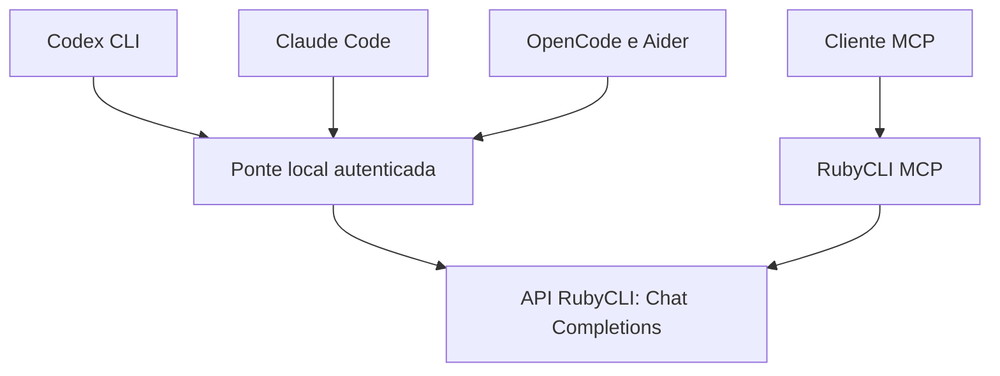

<div align="center">
  <a href="https://app.rubycli.cloud"></a>
  <h1>Seus modelos. Seu terminal.</h1>
  <p>Instalador independente, perfis próprios e uma ponte entre a RubyCLI e suas ferramentas de desenvolvimento.</p>
  <p>
    
    
    
  </p>
  <p><a href="https://app.rubycli.cloud">Plataforma</a> · <a href="https://app.rubycli.cloud/docs">API</a> · <a href="docs/CLIENTS.md">Clientes</a> · <a href="docs/COMPATIBILITY.md">Compatibilidade</a></p>
</div>


## O que é

RubyCLI conecta os modelos liberados na sua conta ao terminal, ao Codex CLI, ao Claude Code, ao OpenCode, ao Aider e a clientes MCP. Você escolhe como usar:

- **Terminal:** consulte modelos, converse e revise um arquivo com os comandos RubyCLI.
- **Cliente separado:** `rubycli launch codex` ou `rubycli launch claude` abre o cliente instalado usando um perfil RubyCLI próprio.
- **MCP:** adicione uma conexão chamada `rubycli` ao seu cliente atual para consultar modelos e delegar análises, mantendo o modelo principal do cliente.

O instalador não substitui os comandos `codex`, `claude`, `opencode` ou `aider`. Também não edita seus arquivos de shell, instala clientes automaticamente, copia credenciais pessoais ou ativa opções para ignorar aprovações. As sessões RubyCLI usam estado próprio; o diretório de trabalho continua sendo o seu projeto.

**Versão: 0.1.1.** Inclui a correção da execução do npm no Windows. Os protocolos adaptados têm limites documentados. Compatibilidade de texto não garante que todo modelo execute ferramentas corretamente. Veja a [matriz de compatibilidade](docs/COMPATIBILITY.md) e os [resultados de validação](docs/VALIDATION.md).

## Instalação

Requisitos: **Node.js 22.16+ com npm**, conexão com a internet e uma chave ativa da [RubyCLI](https://app.rubycli.cloud/settings). Para abrir outro cliente, ele também precisa estar instalado.

Baixe e extraia o ZIP deste projeto, ou clone o repositório onde ele foi publicado. Entre na pasta que contém este README.

### Windows

No PowerShell:

```powershell
.\install.ps1
& "$env:USERPROFILE\.rubycli\bin\rubycli.cmd" setup
```

Se a política do PowerShell não permitir executar o arquivo, use o instalador Node diretamente, sem alterar a política do computador:

```powershell
node .\scripts\install.mjs
```

**Atualizando da 0.1.0:** se a instalação parou em `COMMAND_FAILED` ao instalar dependências, extraia o ZIP **0.1.1** em uma nova pasta e execute o instalador dessa pasta. A atualização preserva os perfis RubyCLI existentes. A versão corrigida usa o Node para iniciar o npm no Windows e inclui a codificação necessária para os acentos no Windows PowerShell 5.1.

### macOS, Linux e WSL

```sh
sh install.sh
"$HOME/.rubycli/bin/rubycli" setup
```

O aplicativo fica em `~/.rubycli/app`, com os comandos em `~/.rubycli/bin`. Não é necessário `sudo`. O instalador mostra o caminho exato e o comando para adicionar a pasta ao PATH da sessão. Para usar apenas `rubycli` em novos terminais, adicione essa pasta ao PATH do seu usuário.

Instale sem modificar nenhuma configuração do sistema. O Node e o npm precisam estar disponíveis antes da instalação.

### Uso portátil, direto do código

```sh
npm ci --ignore-scripts
node bin/rubycli.mjs setup
node bin/rubycli.mjs --help
```

O projeto não pressupõe um pacote já publicado no npm. Veja [Publicação no GitHub e npm](docs/PUBLISHING.md) para distribuir a sua versão.

## Primeiro acesso

1. Crie uma chave em **Chaves de API**, no [painel RubyCLI](https://app.rubycli.cloud/settings).
2. Execute `rubycli setup` e informe a chave no campo oculto.
3. Escolha onde armazená-la e selecione um modelo retornado pela sua conta.
4. Execute `rubycli doctor` para verificar configuração e catálogo.

O endpoint padrão vem da documentação RubyCLI:

```text
https://app.rubycli.cloud/v1
```

O catálogo é consultado em `/v1/models`; as gerações usam `/v1/chat/completions`. Os IDs não são fixados no código. O saldo e a cobrança em **Ruby Units** são acompanhados no painel, sem estimativas de preço inventadas pelo instalador.

### Armazenamento da chave

| Opção do setup | Comportamento |
| --- | --- |
| `keychain` | Cofre Chaves do macOS. |
| `dpapi` | Arquivo cifrado pelo Windows para o usuário atual. |
| `secret-service` | Cofre Secret Service no Linux, via `secret-tool`; requer sessão/cofre disponível. |
| `env` | Não salva a chave; usa `RUBY_API_KEY` no ambiente. Padrão em Linux sem Secret Service e em setup não interativo. |
| `file` | Salva a chave em texto no perfil RubyCLI. É uma escolha explícita; no POSIX o arquivo usa modo 0600. No Windows, as permissões dependem das ACLs da pasta do usuário. |

Se o cofre falhar, a RubyCLI informa o erro. Não muda silenciosamente para armazenamento em texto. Nunca coloque uma chave em argumentos, prints, commits ou configurações públicas de MCP.

Escolher `env` no setup remove a credencial anteriormente salva naquele perfil; a chave deverá estar no ambiente nas próximas sessões.

Para automação, injete `RUBY_API_KEY` pelo gerenciador de segredos do seu ambiente e execute:

```sh
rubycli setup --model ID_DO_CATALOGO --store-key env
```

Também existe `--key-stdin`, para receber a chave por entrada padrão. `--no-verify --model ID` configura offline; a validade da chave será verificada no primeiro uso online.

## Comandos principais

```sh
rubycli                           # Menu interativo
rubycli models                    # Lista o catálogo da conta
rubycli ask "Explique closures em JavaScript"
rubycli chat                      # Conversa; /sair encerra
rubycli review --file src/app.ts   # Envia somente o arquivo indicado
rubycli usage                     # Contadores locais de hoje, em UTC
rubycli doctor                    # Configuração + catálogo
rubycli verify                    # 3 chamadas reais: texto, SSE e ferramentas
```

`verify` consome créditos e não executa a ferramenta sugerida pelo modelo. Ele verifica uma resposta de função, não certifica um ciclo completo de edição do seu projeto.

Selecione outro modelo com `--model ID`. Use `--json` em `ask`, `models` e `doctor` para saída estruturada. `ask --no-stream` aguarda a resposta completa. `review --file` envia o conteúdo à RubyCLI; selecione somente arquivos que pretende compartilhar.

### Abrir um cliente

```sh
rubycli launch claude
rubycli launch codex
rubycli launch opencode
rubycli launch aider

rubycli launch codex --model ID_DO_CATALOGO -- exec "Explique este projeto"
rubycli launch claude -- -p "Resuma o README"
rubycli launch claude --temporary
```

Argumentos após `--` são encaminhados ao cliente como argumentos individuais. Flags que substituem modelo, provedor ou arquivos de configuração são reservadas; use as opções RubyCLI correspondentes.

`--temporary` remove o estado da sessão RubyCLI na saída normal, falha de inicialização e encerramento tratado. Sem essa opção, o estado do cliente fica em `~/.rubycli/clients/<perfil>/<cliente>` para uso posterior. Interrupções forçadas do sistema podem deixar arquivos temporários.

Perfis de configuração não são uma sandbox: o cliente continua podendo ler e alterar o projeto conforme as suas permissões. Configurações do projeto, políticas gerenciadas e versões dos clientes também podem afetar a execução. O launcher não altera políticas corporativas.

## MCP: RubyCLI no seu cliente atual

Gere o trecho de configuração:

```sh
rubycli mcp-config
rubycli mcp-config --format codex
```

O comando usa caminhos absolutos da instalação e não escreve no cliente. Adicione **somente a entrada `rubycli`** à configuração MCP existente; preserve todas as outras entradas. O formato `json` usa `mcpServers` e atende Claude Desktop/Cursor e hosts com esse esquema. O formato `codex` usa TOML. Para OpenCode, veja a adaptação em [Clientes](docs/CLIENTS.md).

Use uma chave salva no perfil ou garanta que o aplicativo do cliente herde `RUBY_API_KEY`. Aplicativos abertos pelo ícone podem não herdar variáveis do seu terminal. O trecho não inclui a chave.

| Ferramenta | Para que serve |
| --- | --- |
| `ruby_models` | Consultar os IDs disponíveis para sua conta. |
| `ruby_ask` | Enviar uma pergunta com contexto e modelo opcional. |
| `ruby_review` | Revisar código fornecido no próprio pedido. |
| `ruby_job_start` | Iniciar uma consulta em fila e obter `job_id`. |
| `ruby_job` | Consultar progresso e resultado. |
| `ruby_jobs` | Listar tarefas da sessão MCP. |
| `ruby_job_cancel` | Cancelar uma tarefa. |
| `ruby_usage` | Consultar contadores locais de tokens. |

Exemplo de pedido ao seu assistente:

> Use `ruby_review` para analisar este trecho com foco em erros de concorrência. Apresente as sugestões antes de modificar os arquivos.

Essas ferramentas enviam apenas o contexto recebido; não leem arquivos do computador, executam shell nem aplicam mudanças por conta própria. O cliente principal continua responsável por editar, testar e aprovar ações. Tarefas MCP consomem créditos da RubyCLI e exigem a autorização normal do host.

Os jobs ficam em memória, com até 2 execuções simultâneas por padrão. Resultados expiram após 10 minutos; metadados terminais sem resultado, após 30 minutos. Reiniciar o servidor encerra os jobs e descarta seus resultados. Cancelar uma chamada não reembolsa processamento já realizado pelo provedor.

## Como a ponte funciona



O launcher inicia a ponte em `127.0.0.1`, em uma porta livre. Uma credencial local aleatória é fornecida ao subprocesso; a chave RubyCLI permanece no processo que conversa com a API. Ao sair do cliente, a ponte encerra.

- Claude Code: tradução do formato Messages para Chat Completions.
- Codex: tradução do formato Responses para Chat Completions.
- OpenCode e Aider: formato Chat Completions.
- MCP e terminal: acesso direto à API RubyCLI.

A tradução cobre texto, imagens em URL/base64 e ferramentas de função. Há suporte a ferramentas textuais customizadas de Responses por encapsulamento em uma função; gramáticas customizadas não são impostas pela ponte. Argumentos de ferramentas são acumulados até estarem completos, enquanto texto é transmitido em streaming.

Busca web do provedor, computer use, Files API, compactação de Responses, WebSockets e assinaturas de raciocínio não são implementados. Não é uma implementação integral das APIs OpenAI/Anthropic. Veja [Compatibilidade](docs/COMPATIBILITY.md).

## Perfis, atualização e remoção

```sh
rubycli setup --profile trabalho
rubycli launch codex --profile trabalho
rubycli mcp-config --profile trabalho
```

`RUBYCLI_HOME` escolhe a pasta de estado, inclusive para perfis e credenciais. `node scripts/install.mjs --prefix DIRETORIO` escolhe a pasta do aplicativo; mudar o prefixo não muda o estado por si só.

Para atualizar, execute novamente o instalador a partir da versão nova. A aplicação é preparada em outra pasta antes de trocar os comandos; uma falha nas dependências preserva a instalação anterior. Configurações RubyCLI e dados dos clientes permanecem separados.

Para remover a chave salva de um perfil:

```sh
rubycli logout --profile trabalho --yes
```

Isso não revoga a chave na plataforma e não remove uma variável de ambiente. Para remover o aplicativo, usando a pasta extraída do projeto:

```sh
node scripts/uninstall.mjs --yes
```

A desinstalação preserva perfis, chaves e históricos. Clientes existentes permanecem instalados. Mais detalhes em [Operação e solução de problemas](docs/OPERATIONS.md).

## Desenvolvimento

```sh
npm ci --ignore-scripts
npm run check
npm test
npm run pack:check
```

A suíte usa uma API local simulada e credenciais fictícias. Há testes de protocolos, MCP stdio real, isolamento de perfis, argumentos, instalação, atualização e fila de jobs. O workflow de CI cobre Windows, macOS e Linux com Node 22 e 24; os resultados só aparecem após publicar e executar o workflow no seu GitHub.

## Referências e licença

Este projeto aproveita duas referências fornecidas para sua criação:

- [quebragalho-installer](https://github.com/nikolasdehor/quebragalho-installer): inspiração para o fluxo de instalação e isolamento; essa parte foi implementada de forma independente porque o snapshot consultado não declarava licença.
- [quebragalho-bridge](https://github.com/danjour/quebragalho-bridge): fila de jobs e testes de regressão adaptados sob MIT, com atribuição preservada. Também inspirou o modo MCP e a contabilização limitada a metadados.

Código RubyCLI sob [MIT](LICENSE). As marcas e os logotipos pertencem aos seus respectivos titulares. Consulte [THIRD_PARTY_NOTICES.md](THIRD_PARTY_NOTICES.md) para origem, commits e alterações.

RubyCLI é uma integração independente; não implica endosso da OpenAI, Anthropic ou dos demais clientes.
